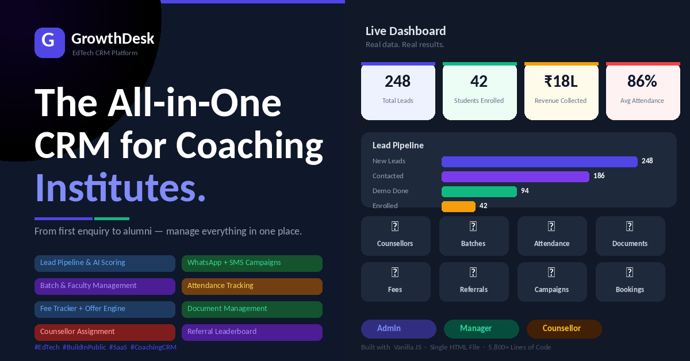
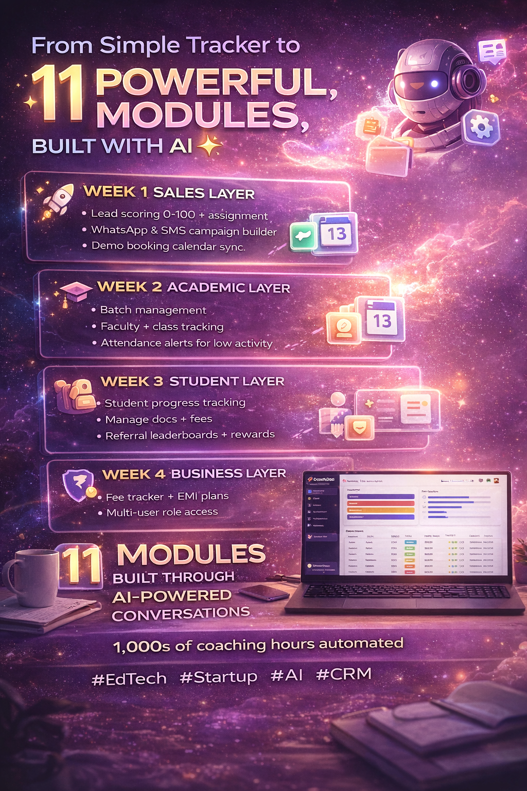
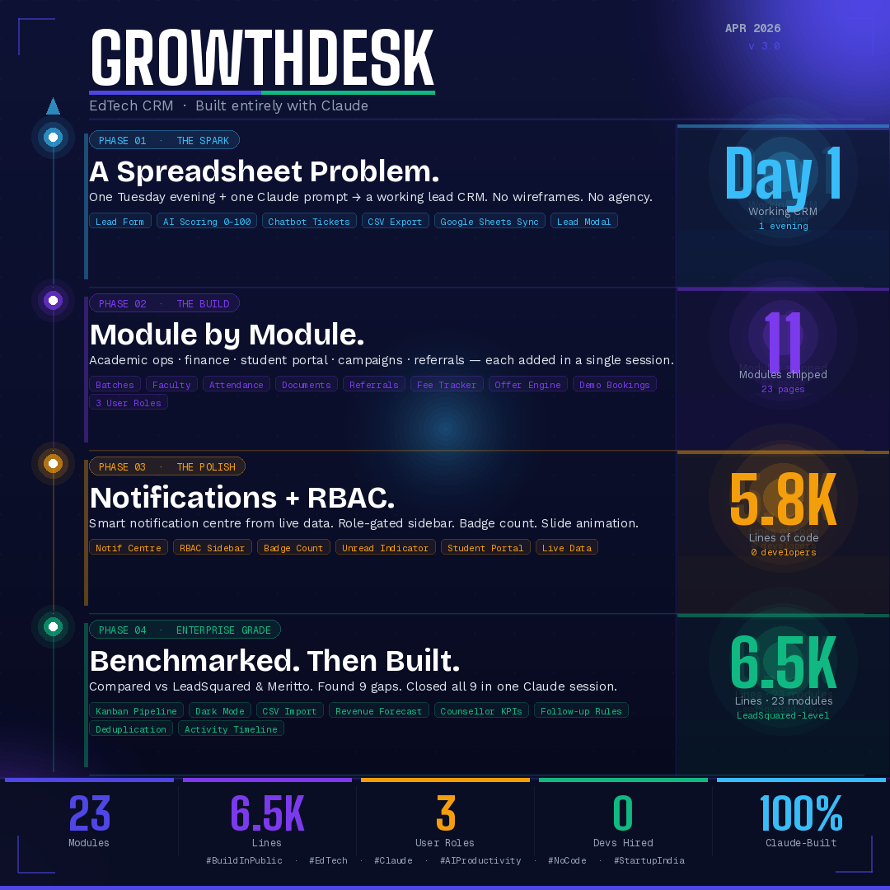

# GrowthDesk — EdTech CRM Built Entirely with Claude

> A full-featured, enterprise-grade CRM for JEE/CET coaching institutes — built as a **single HTML file**, with **zero backend dependencies**, **zero npm packages**, and **zero developers hired**.

**Built by:** Shwetha · **Stack:** HTML + CSS + JavaScript + localStorage (+ optional Google Apps Script & n8n) · **AI:** Claude (Anthropic)



---

## What is GrowthDesk?

GrowthDesk started as a solution to a real problem — a coaching institute drowning in Excel spreadsheets, losing leads, and struggling to manage students, counsellors, and fees across multiple tools.

In one evening, using a single Claude prompt, a working CRM was born. Over the following weeks, it evolved into a platform competitive with paid tools like LeadSquared and Meritto — entirely through conversations with Claude.

**No wireframes. No agency. No developers. Just Claude.**

---

## Architecture

| Property | Detail |
|----------|--------|
| **Type** | Single-file HTML SPA |
| **Data** | Browser localStorage (offline-first, no server needed) |
| **Optional sync** | Google Apps Script Web App → Google Sheets |
| **Optional automation** | n8n workflows for ticket lifecycle |
| **Frontend dependencies** | Zero — no npm, no frameworks, no CDN |
| **Deployment** | Open `index.html` in any browser. That's it. |
| **Size** | ~430 KB · 7,500+ lines |
| **PWA** | Installable as a mobile/desktop app |

---

## Features — 29 Modules

### Lead Management
- **Lead Registration Form** — AI-powered scoring (0–100) on submit
- **Kanban Pipeline** — drag-and-drop across Lead → Contacted → Demo → Enrolled → Lost
- **All Leads** — filterable table with age badges, score pills, clickable detail modal
- **Lead Scoring** — multi-factor algorithm (exam, PCM %, interest, income, source, city)
- **Deduplication** — blocks exact phone+email duplicates with override option
- **CSV Import** — bulk upload leads from spreadsheet in one click
- **Behavioural Scoring** — tracks calls logged, demos attended, forms submitted, documents viewed

### Academic Operations
- **Batch Management** — create and manage JEE/CET batches with faculty assignment
- **Faculty Management** — profiles, subjects, batch assignments
- **Attendance Tracking** — mark and review daily attendance per batch
- **Mock Tests** — record and track student test scores
- **Course Materials** — upload and share study resources per batch

### Finance
- **Fee Tracker** — record payments, track outstanding balances
- **EMI Tracker** — auto-splits fees into 3 instalments with due dates
- **Revenue Forecast** — 30-day projection based on hot + warm leads × avg fee × conversion rate
- **Offer Engine** — create scholarship and discount offers

### Analytics & Reporting
- **Analytics Dashboard** — lead funnel, city breakdown, exam split, source analysis
- **Counsellor Performance** — calls, enrolments, revenue per counsellor
- **Revenue Reports** — P&L summary, collection vs outstanding
- **Follow-up Automation Rules** — configurable triggers (48hr no-response, hot lead alerts, 7-day stale re-engage)

### AI / Enterprise Features
- **At-Risk Detection** — scans all students against 5 rules (attendance, mock score, fee overdue, login gap, progress stall)
- **Drip Campaigns** — 5-stage automated nurture sequences (Day 0→2→5→7→10) via WhatsApp/SMS
- **Adaptive Learning Path** — generates topic-by-topic study plan based on mock test scores
- **Gamification** — XP points, streaks, badges (First Enrolment, Perfect Attendance, Mock Star)
- **Parent Reports** — auto-generated weekly summaries with WhatsApp share link

### Compliance & Legal (LegalTech Integration)
- **DPDP Data Check** — verify student data handling against India's DPDP Act 2023; risk score in <1 second
- **Market Entry Checker** — for any state + sector, returns applicable laws, required licenses, and restrictions before campaign launch
- **Campaign Compliance Review** — every campaign body scanned for misleading claims, missing disclaimers, and DPDP violations before saving
- **Compliance Activity Log** — full audit trail (check type, subject, result, risk level, timestamp) — exportable for legal documentation
- **Live KPI Dashboard** — Total Checks · DPDP Compliant · Flagged · Compliance Rate (target ≥ 95%)

### Users & Support
- **Role-based sidebar** — Admin, Manager, Counsellor (each sees only their permitted modules; configured via `ROLE_PERMISSIONS` and applied at login)
- **Student Portal** — students log in with Lead ID + email to view progress, attendance, fees
- **Support Chatbot** — ticket state machine (query → description → priority → confirm → rating)
- **Notification Centre** — live badge count, unread indicator, mark-all-read
- **Demo Bookings** — schedule and manage free demo sessions
- **Referral Tracking** — log and reward student referrals

### Data Management
- **Export** — leads CSV, fees CSV, students CSV, full JSON backup
- **Import / Restore** — restore from JSON backup, bulk CSV lead upload
- **Dark Mode** — system-wide toggle
- **PWA Manifest** — install GrowthDesk as an app on any device

---

## Three design versions

GrowthDesk ships in three visual styles — same features, same JavaScript, different aesthetic. Pick whichever matches your audience. **v3 (AI Edition) is the recommended primary** — it's the most distinctive and sets GrowthDesk apart from generic Indian EdTech.

| File | Style | Best for |
|------|-------|----------|
| [`index-v3.html`](index-v3.html) ⭐ | **v3 — Premium EdTech** (white base, deep indigo + vivid coral CTA, Plus Jakarta Sans, generous whitespace, subtle dual radial gradient) | The flagship. Synthesised from leading EdTech platforms (Coursera trust, Vedantu/BYJU'S CTA energy, Cuemath/Notion polish, PhysicsWallah confidence). Best for selling to coaching institute owners and signalling category leadership. |
| [`index-v2.html`](index-v2.html) | **v2 — Modern Editorial** (cream + indigo + lime, generous whitespace, Fraunces serif moments, hairline borders) | Selling to coaching institute owners. Professional B2B feel. Trustworthy rather than flashy. |
| [`index.html`](index.html) | **v1 — Futuristic** (indigo + violet gradients, glassy nav, energetic) | The original direction. Light, gradient-led, consumer-app feel. |

All three share the same `DEMO_CREDENTIALS`, `ROLE_PERMISSIONS`, and feature set — only the CSS differs. Switch between them by opening any of the HTML files. The student portal has the same split: [`student-portal.html`](student-portal.html), [`student-portal-v2.html`](student-portal-v2.html), [`student-portal-v3.html`](student-portal-v3.html).

> v2 and v3 use Google Fonts (Inter + Fraunces) for editorial typography. They load from `fonts.googleapis.com` — the only external request the app makes. Strip the `@import` line at the top of the relevant overrides block to go back to fully offline.

---

## Getting Started

### 1. Clone and open

```bash
git clone https://github.com/YOUR_USERNAME/growthdesk.git
cd growthdesk
open index-v3.html      # macOS — v3 AI Edition (recommended)
open index-v2.html      # macOS — v2 Editorial
open index.html         # macOS — v1 Futuristic
start index-v3.html     # Windows
xdg-open index-v3.html  # Linux
```

No build step. No `npm install`. Any of the three files runs straight from disk.

### 2. Demo login

Three roles, three sets of credentials. Each role sees a different sidebar — Admin gets everything, Manager gets the leadership / analytics view, Counsellor gets the day-to-day operations view.

| Role | Email | Password |
|------|-------|----------|
| Admin | `support@growthdesk.in` | `admin123` |
| Manager | `manager@growthdesk.in` | `manager123` |
| Counsellor | `counsellor@growthdesk.in` | `counsel123` |

The login form pre-fills the Admin credentials for convenience. To customise, edit the `DEMO_CREDENTIALS` array in `index.html` — and wire up real auth before deploying to real users.

### 3. Load sample data

1. Go to **All Leads** in the sidebar
2. Click **📥 Import CSV**
3. Select `sample_leads.csv` from this repo
4. 20 leads load instantly with AI scores calculated

### 4. (Optional) Connect Google Sheets backup

The app works fully offline. If you want every lead and ticket synced to a Google Sheet:

1. Open a Google Sheet → **Extensions → Apps Script**
2. Paste the contents of [`apps-script/Code.gs`](apps-script/Code.gs)
3. **Edit `ADMIN_EMAIL` at the top** to your real admin inbox (the placeholder is `admin@yourdomain.com`)
4. **Deploy → New deployment → Web App** (Execute as: Me, Who has access: Anyone)
5. Copy the Web App URL → in GrowthDesk, go to **Settings → Sheets URL** and paste it

### 5. (Optional) Import the n8n workflows

See [`workflows/README.md`](workflows/README.md) for ticket / complaint / human-handoff automation.

---

## Repository Structure

```
growthdesk/
├── index.html                    # v1 — futuristic indigo/violet design
├── index-v2.html                 # v2 — modern editorial design
├── index-v3.html                 # v3 — AI-native dark design (recommended ⭐)
├── student-portal.html           # Student-facing portal (v1 design)
├── student-portal-v2.html        # Student-facing portal (v2 editorial)
├── student-portal-v3.html        # Student-facing portal (v3 AI-native)
├── sample_leads.csv              # 20 sample leads for the CSV import demo
├── apps-script/
│   └── Code.gs                   # Google Apps Script backend (optional)
├── workflows/
│   ├── README.md                 # How to import these into n8n
│   ├── ticket_workflow.json
│   ├── complaint_escalation.json
│   └── talk_to_human.json
├── docs/
│   ├── README.md                 # Docs index
│   ├── project-brief.md          # Full product brief (public-safe)
│   ├── legaltech-api-spec.md     # Compliance API integration spec
│   └── screenshots/              # Feature screenshots
├── LICENSE
├── README.md
└── .gitignore
```

---

## Screenshots

> Replace these placeholder graphics with screenshots of the actual app dashboard, Kanban pipeline, AI quiz, compliance tab, and student portal as you publish.

| | |
|---|---|
|  |  |
| *Platform overview* | *Module evolution* |

---

## Evolution — How This Was Built

| Phase | What Was Built | Stat |
|-------|---------------|------|
| **Phase 1 — The Spark** | Lead form, AI scoring, support tickets, chatbot, CSV export | Day 1 · 1 evening |
| **Phase 2 — The Build** | Batches, faculty, attendance, fees, referrals, bookings, 3 user roles | 11 modules |
| **Phase 3 — The Polish** | Notification centre, RBAC sidebar, badge count, student portal | 5,800 lines |
| **Phase 4 — Enterprise Grade** | Benchmarked vs LeadSquared & Meritto · Closed 9 feature gaps in 1 session | 6,500+ lines |
| **Phase 5 — AI Native** | Behavioural scoring, at-risk detection, drip campaigns, gamification, EMI, adaptive learning | 7,500+ lines |
| **Phase 6 — Compliance** | DPDP data checks, market entry checker, campaign compliance review | LegalTech integration |

---

## Customisation

Since it's a single HTML file, customisation is straightforward:

- **Change institute name/branding** — search for `GrowthDesk` in `index.html` and replace
- **Add cities/exams** — update the dropdowns in the lead form section
- **Adjust AI scoring weights** — edit the `calcScore()` function
- **Add user roles** — extend the `ROLE_PERMISSIONS` object and append a new entry to `DEMO_CREDENTIALS`; the sidebar will auto-gate based on the new role's allowlist
- **Change fee structure** — update `generateEMISchedule()` for different instalment splits

---

## Comparing to Paid CRMs

| Feature | GrowthDesk | LeadSquared | Meritto |
|---------|-----------|-------------|---------|
| Lead scoring | AI (0–100) | yes | yes |
| Kanban pipeline | yes | yes | yes |
| RBAC | 3 roles | yes | yes |
| Drip campaigns | yes | yes | yes |
| At-risk detection | yes | no | no |
| Gamification | yes | no | no |
| Adaptive learning | yes | no | no |
| Parent reports | yes | no | yes |
| EMI tracker | yes | no | yes |
| DPDP compliance checks | yes | no | no |
| Offline / no server | yes | no | no |
| **Cost** | **Free** | **₹5,000+/mo** | **₹8,000+/mo** |

---

## Why This Matters

This project is a proof of concept that a non-developer can build a production-grade SaaS tool using AI — not by learning to code, but by learning to communicate clearly with an AI that can.

Every feature in this repo was built through conversation. No Stack Overflow. No tutorials. No agency.

---

## Contributing

Issues and PRs welcome — particularly in these areas:

- **Accessibility** — adding `aria-label`s, keyboard navigation, screen-reader friendliness
- **Code organisation** — splitting `index.html` into separate `app.js` / `app.css` files for easier maintenance
- **Testing** — there are no automated tests yet; even a small Playwright smoke suite would help
- **Translations** — currently English-only; Hindi / regional language packs would expand reach

---

## Acknowledgements

Built through conversation with [Claude](https://www.anthropic.com/claude) (Anthropic). The architecture decisions, code, copywriting, and iterations are all documented in the project brief inside `docs/`.

---

## License

[MIT](LICENSE) — free to use, fork, and build on.

---

*Built with Claude · #BuildInPublic #EdTech #NoCode #AIProductivity #StartupIndia*
